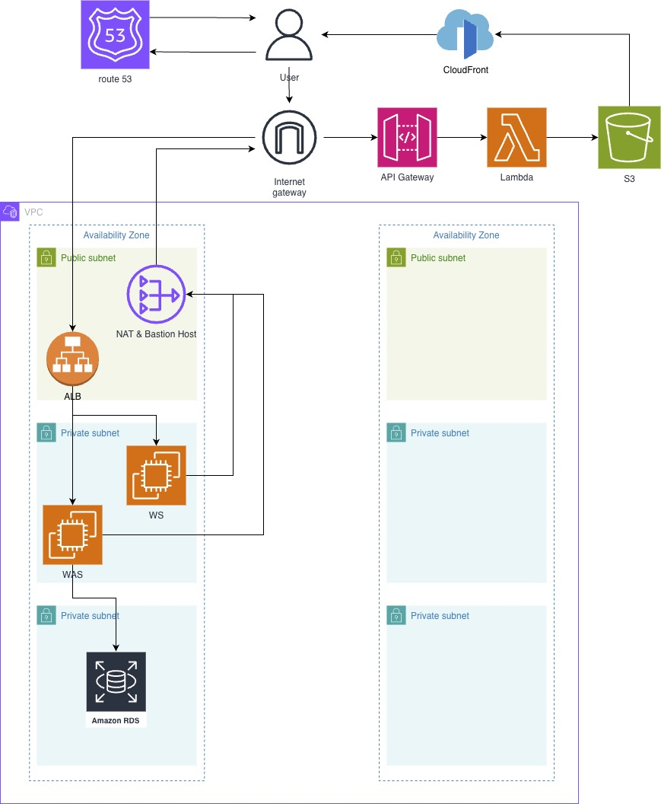

# 🏠 대청마루 (Daechungmaru) - Backend

> **당신의 이야기가 머무는 곳,**
> 
> **대청마루** 커뮤니티 서비스의 백엔드 레포지토리입니다.

## 📖 프로젝트 소개

**대청마루**는 사용자들이 자유롭게 소통할 수 있는 커뮤니티 서비스의 백엔드 API 서버입니다.

**Java 21**과 **Spring Boot**를 기반으로 구축되었으며, 안정적인 데이터 처리와 확장성을 최우선으로 고려한 **RESTful API** 원칙을 준수합니다.
대용량 트래픽 처리를 고려하여 QueryDSL을 이용한 쿼리 최적화,
**비관적 락(Pessimistic Lock)**을 통한 동시성 제어를 구현했습니다.

## 🛠 기술 스택 (Tech Stack)

* **Language:** Java 21
* **Framework:** Spring Boot 3.x
* **Database:** MySQL 8.0, Spring Data JPA
* **Infrastructure:** Docker, Docker Compose
* **CI/CD:** GitHub Actions, AWS CodeDeploy, AWS S3

## ✨ 주요 기능 (Key Features)

### 1. 인증 및 보안 (Authentication & Security)
* **JWT 기반 인증:** Access Token과 Refresh Token을 분리하여 보안성과 사용자 편의성을 동시에 확보.
* **Refresh Token 관리:** DB 기반의 Refresh Token 저장소를 구축하여 토큰 탈취 시 강제 로그아웃(revoke) 기능 구현.
* **비밀번호 암호화:** BCrypt 해싱 알고리즘을 적용하여 사용자 비밀번호를 안전하게 저장.

### 2. 게시글 시스템 (Post System)
* **성능 최적화 조회:** `QueryDSL`과 `Slice` 인터페이스를 활용하여 Count 쿼리가 발생하지 않는 무한 스크롤(No-Offset 방식) 구현.
* **동시성 제어:** 게시글 조회수/좋아요 집계 시 발생할 수 있는 Race Condition 방지를 위해 `Pessimistic Lock`(비관적 락) 및 별도 트랜잭션 분리(`Propagation.REQUIRES_NEW`) 적용.
* **이미지 처리:** 게시글 내 다중 이미지 업로드 지원 및 썸네일 자동 지정 로직 구현.

### 3. 댓글 및 상호작용 (Interaction)
* **댓글 관리:** 게시글에 대한 댓글 작성, 수정, 삭제(Soft Delete) 기능.
* **페이징:** '더보기' 버튼을 통한 댓글 페이징 처리.

### 4. 데이터 무결성 및 관리 (Data Integrity)
* **Soft Delete:** `AbstractAuditable`을 상속받아 모든 엔티티에 대해 물리적 삭제 대신 `deleted_at` 타임스탬프를 찍는 논리적 삭제 구현.
* **감사(Auditing):** 생성일, 수정일, 생성자, 수정자를 자동으로 추적하여 데이터 이력 관리.

### 5. 인프라 및 파일 처리 (Infrastructure)
* **AWS S3 & CloudFront:** 이미지 파일을 AWS S3에 저장하고, CloudFront(CDN)를 통해 조회 속도 최적화.
* **환경 분리:** `FileService` 인터페이스를 통해 로컬 개발 환경과 배포 환경(S3)의 파일 처리 로직을 유연하게 교체 가능.

## 🔄 CI/CD 파이프라인

GitHub Actions와 AWS CodeDeploy를 통해 자동화된 배포 파이프라인을 구축했습니다.
1. **Push to `develop`**: 코드가 develop 브랜치에 푸시되면 워크플로우가 트리거됩니다.
2. **Test**: Gradle을 사용하여 프로젝트를 빌드하고 테스트를 수행합니다.
3. **Dockerizing**: `Dockerfile`의 Multi-stage build를 통해 최적화된 이미지를 생성하고 Docker Hub에 푸시합니다.
4. **Deploy**: 배포 스크립트와 설정 파일을 AWS S3로 전송하고, AWS CodeDeploy를 트리거하여 EC2 인스턴스에 배포합니다.

## ☁️ 인프라 아키텍처 (Infrastructure Architecture)

대청마루 서비스는 AWS 클라우드 환경에서 **보안(Security)**과 **가용성(Availability)**을 최우선으로 고려하여 설계되었습니다. VPC(Virtual Private Cloud)를 기반으로 네트워크 영역을 철저히 분리하였으며, 정적 리소스와 동적 요청을 효율적으로 처리하기 위해 하이브리드 아키텍처를 채택했습니다.

## 🏛 아키텍처 구성 요소 및 특징
### 1. 네트워크 및 보안 (VPC & Network Security)
* VPC (Virtual Private Cloud): 논리적으로 격리된 가상 네트워크 환경을 구성하여 외부의 무분별한 접근을 차단합니다.
* Subnet 분리 (Public vs Private):
  * Public Subnet: 외부 인터넷과 직접 통신이 가능한 영역으로, 로드밸런서(ALB)와 NAT 인스턴스, Bastion Host(관리용)가 위치합니다.
  * Private Subnet: 외부에서 직접 접근할 수 없는 보안 영역입니다. 핵심 애플리케이션 서버(WAS)와 데이터베이스(RDS)를 배치하여 데이터 유출 및 해킹 위협을 최소화했습니다.
  * NAT Instance: Private Subnet에 위치한 서버들이 OS 업데이트나 외부 API 호출을 할 수 있도록, 아웃바운드 트래픽만을 허용하는 NAT 인스턴스를 구성했습니다.
### 2. 트래픽 분산 및 부하 관리 (Load Balancing)
* ALB (Application Load Balancer): 사용자로부터 들어오는 트래픽을 받아 뒷단의 Web Server(WS) 및 Web Application Server(WAS)로 균등하게 분산시킵니다. L7 계층에서 동작하며, SSL/TLS 인증서를 통한 HTTPS 암호화 통신을 지원합니다.
### 3. 애플리케이션 및 데이터 (Compute & Database)
* WS / WAS 계층 분리: 정적 처리를 담당하는 Web Server와 비즈니스 로직을 수행하는 WAS(Spring Boot)를 Private Subnet에 배치하여 보안을 강화했습니다.
* Amazon RDS: 관계형 데이터베이스(MySQL)를 Private Subnet 최하단에 배치하여 외부 접근을 원천 차단하고, 안정적인 데이터 저장을 보장합니다.
### 4. 정적 리소스 및 서버리스 (Static Content & Serverless)
* CloudFront & S3: 이미지 파일은 S3에 저장하고, CloudFront(CDN)를 통해 캐싱하여 제공합니다. 이를 통해 서버 부하를 줄이고 사용자에게 빠른 응답 속도를 제공합니다.
* API Gateway & Lambda: 이미지 리사이징이나 단순 업로드와 같은 기능은 서버리스 아키텍처(Lambda)를 활용하여 메인 서버의 리소스를 점유하지 않고 효율적으로 처리합니다.
